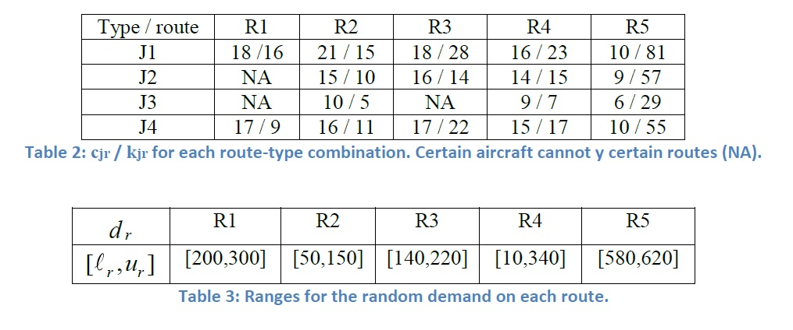
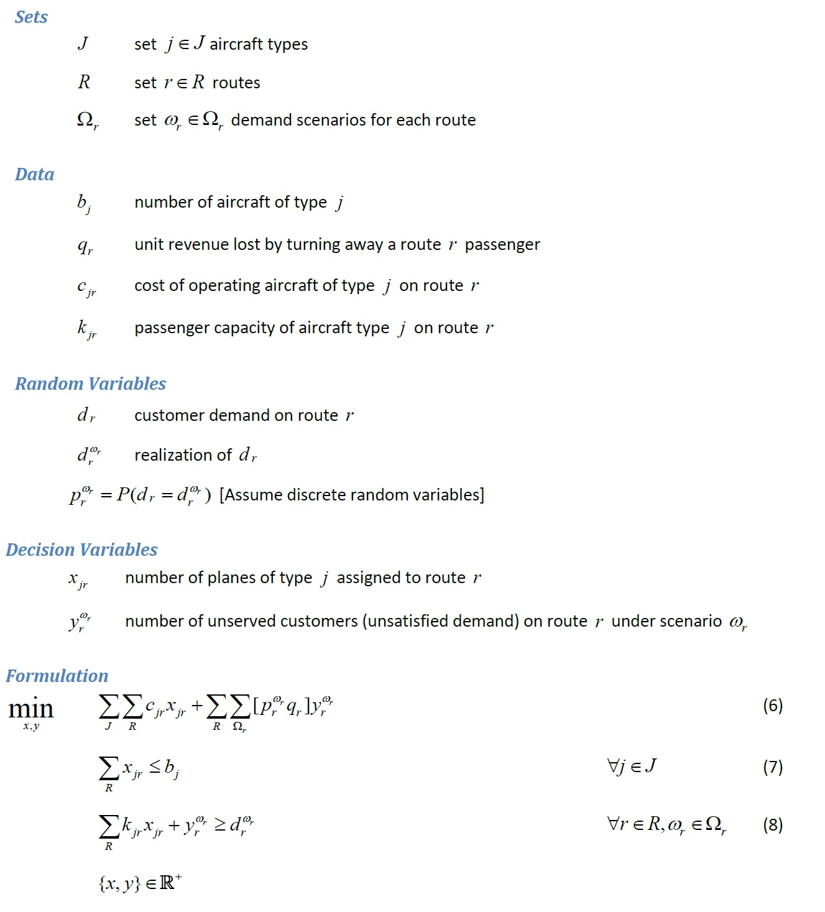

# PyomoModels

Stochastic Optimization

Fall 2010

Coopr Tutorial Project

Description of the problems and formulation could be found in StochasticOptimizationExamples_2010.pdf or in the following link.

https://projects.coin-or.org/Coopr/export/9398/pyomo.data/trunk/pyomo/data/pysp/UTPySPExamples.pdf

# Aircraft Allocation

Description

(Dantzig and Ferguson) Consider the following instance of the aircraft allocation model:
|J| = number of plane types = 4; |R| = number of routes = 5
b = [10; 19; 25; 15] available aircraft
q = [13; 13; 7; 7; 1] bump cost

Implement and solve the aircraft allocation model as formulated in the notes with each
dr distributed as a discrete uniform random variable with 100 realizations on the ranges shown in Table 3.

The objective (6) minimizes the cost of operating and the expected cost due to unsatisfied demand over
all scenarios. Constraint (7) limits number of aircraft based on the number available. Constraint (8)
defines unsatisfied demand as nonnegative difference between demand and available capacity. 

