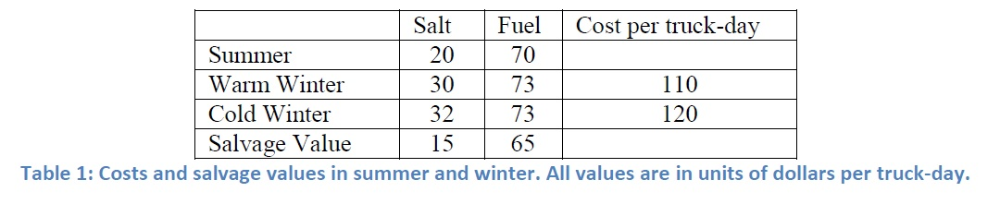

# PyomoModels

Stochastic Optimization

Fall 2010

Coopr Tutorial Project

Description of the problems and formulation could be found in StochasticOptimizationExamples_2010.pdf or in the following link.

https://projects.coin-or.org/Coopr/export/9398/pyomo.data/trunk/pyomo/data/pysp/UTPySPExamples.pdf

# Coldville

Description
(Schrage) The city of Coldville has the opportunity to save money by purchasing raw materials (salt and
truck fuel) for snow removal prior to the onset of winter. There are two snow removal methods: plowing
and salting; the former consumes truck fuel while the latter consumes both truck fuel and salt. Salting is
generally more effective than plowing, particularly during warm winters. However, the salvage value at
the end of the winter is quite low for excess salt. In contrast, truck fuel may be consumed by other city
departments and there is less penalty for stocking too much fuel.

The final column of Table 1 indicates that the cost of operating a truck for one day is $110 in a warm
winter and $120 in a cold winter; these figures are in addition to salt and fuel costs. The city's truck fleet
can work 5000 truck-days during winter. Salting is more effective than plowing. During a warm winter,
one truck salting is equivalent to 1.2 trucks plowing; in a cold winter the efficiency figure is 1.1. If only
plowing were used to remove snow, a warm winter would require 3500 truck-days and a cold winter
5100 truck-days.

Coldville's expert weather forecasting team has predicted that the winter will be warm with probability
0:4 and cold with probability 0:6.

Sets and formula are:

The objective minimizes the total cost as the sum of the summer cost and the expected winter cost over
all weather scenarios. Constraint (2) enforces capacity. Constraint (3) ensures demand is met.
Constraints (4) and (5) ensure the supply of resources is maintained. All variables are non-negative.
