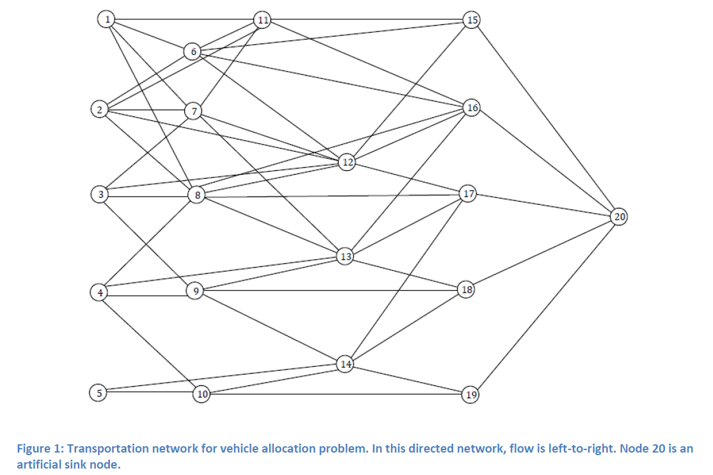
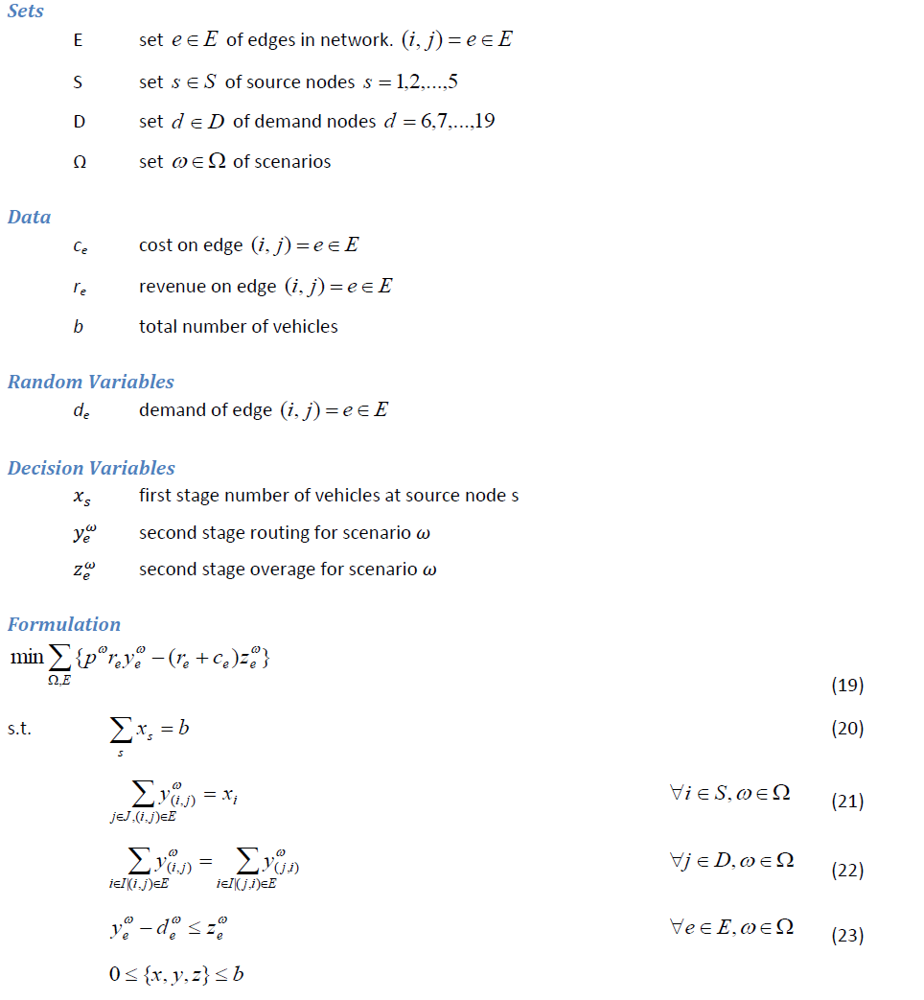
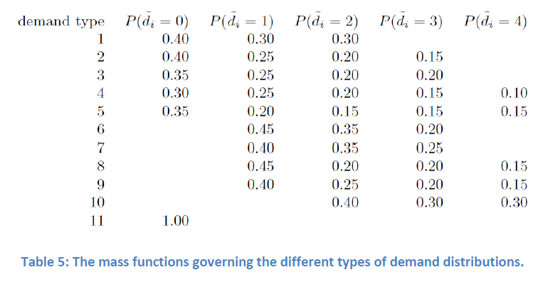
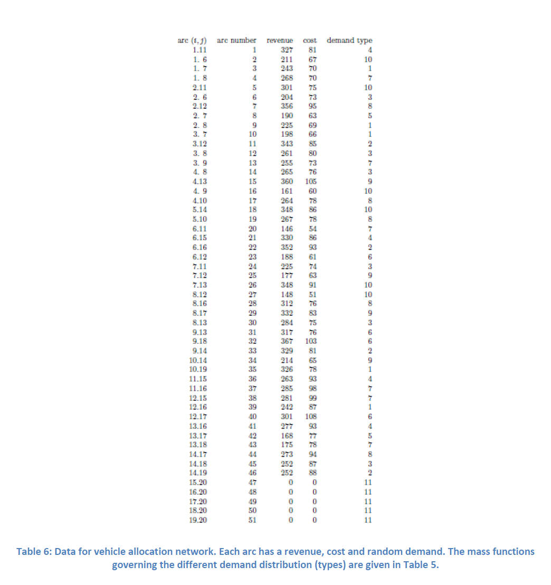

# PyomoModels

Stochastic Optimization

Fall 2010

Coopr Tutorial Project

Description of the problems and formulation could be found in StochasticOptimizationExamples_2010.pdf or in the following link.

https://projects.coin-or.org/Coopr/export/9398/pyomo.data/trunk/pyomo/data/pysp/UTPySPExamples.pdf

# Vehicle Routing

Description

(Birge and Donohue) Vehicles initially positioned at nodes 1-5 must traverse the directed network shown in Figure 1 from left-to-right, ending at node 20. A revenue, cost and demand are associated with each link in the network and these are shown in Table 6. Each vehicle can service one unit of demand per arc so that if two vehicles traverse arc (3, 9) when the demand is three then a revenue of 2•255 is collected. (The “demands” are requests for service, i.e., they need not be satisfied.) If four vehicles traverse (3, 9) when the demand is three, the profit for that arc is 3•255 - 73. Table 5indicates that the random demand on arc (3, 9) can take value 1, 2 or 3. Vehicles must be positioned at the five left-most nodes in the network, prior to the demand being realized. After the demand is realized vehicles are routed through the network so as to maximize profit (revenues less costs). Assume the demands on the 46 arcs are independent and are governed by the distributions specified in Table 5. The goal is to position a fleet of 51 identical vehicles so that expected profit is maximized.

The objective (19) is to maximize profit. Constraint (20) ensures all available vehicles are assigned.
Constraint (21) enforces flow from the assigned vehicles at the source nodes. Constraint (22) ensures 
balance of flow at demand nodes. Constraint (23) defines the excess supply at each node. All variable
are nonnegative and loosely bounded by the total number of available vehicles.

