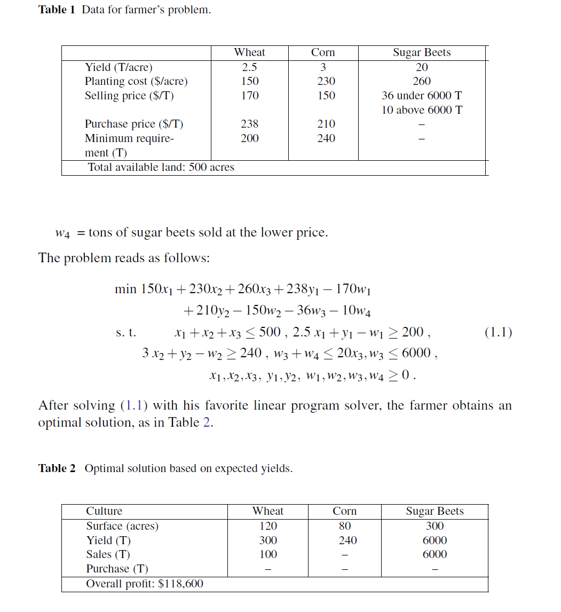

# PyomoModels
This is repository for Pyomo Models .

# Stochastic Programming: Farmers problem

Consider a European farmer who specializes in raising wheat, corn, and sugar beets
on his 500 acres of land. During the winter, he wants to decide how much land to
devote to each crop. (We refer to the farmer as “he” for convenience and not to imply
anything about the gender of European farmers.)

The farmer knows that at least 200 tons (T) of wheat and 240 T of corn are needed
for cattle feed. These amounts can be raised on the farm or bought from a wholesaler.
Any production in excess of the feeding requirement would be sold. Over the last
decade, mean selling prices have been $170 and $150 per ton of wheat and corn,
respectively. The purchase prices are 40% more than this due to the wholesaler’s
margin and transportation costs.

Another profitable crop is sugar beet, which he expects to sell at $36/T; however,
the European Commission imposes a quota on sugar beet production. Any amount
in excess of the quota can be sold only at $10/T. The farmer’s quota for next year is
6000 T.

Based on past experience, the farmer knows that the mean yield on his land is
roughly 2.5 T, 3 T, and 20 T per acre for wheat, corn, and sugar beets, respectively.
Table 1 summarizes these data and the planting costs for these crops.

To help the farmer make up his mind, we can set up the following model. Let

x1 = acres of land devoted to wheat,
x2 = acres of land devoted to corn,
x3 = acres of land devoted to sugar beets,
w1 = tons of wheat sold,
y1 = tons of wheat purchased,
w2 = tons of corn sold,
y2 = tons of corn purchased,
w3 = tons of sugar beets sold at the favorable price,

